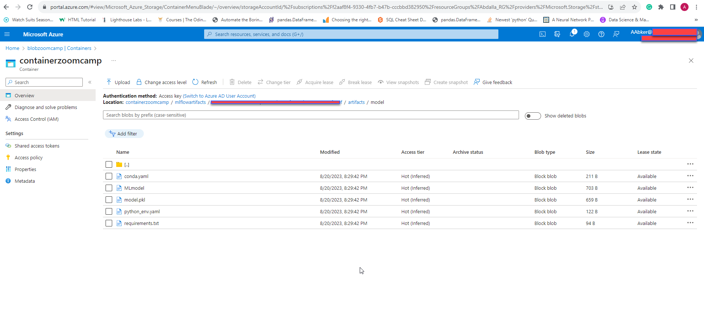

# MLOps Directory Setup and Usage

This guide provides instructions for setting up and using the MLOps environment for managing machine learning workflows using MLflow. Follow the steps below to get started.

- cd path/to/MLOps
- Pipenv (pipenv shell)

## Running MLflow Locally
run this command locally:
- mlflow server --backend-store-uri sqlite:///mlflow.db --default-artifact-root ./artifacts
- You can access the MLflow UI to track experiments in your local browser by visiting: http://127.0.0.1:5000/

## Deploying on Azure Cloud

- mlflow server --backend-store-uri sqlite:///mlflow.db --default-artifact-root azure://containerzoomcamp@blobzoomcamp.blob.core.windows.net/ --host 0.0.0.0
- access the MLflow UI to track experiments on Azure Cloud by visiting: Azure Cloud Browser

## Running the Pipelines
- data_prep_pipeline: Preprocesses data and stores it as pickle files:
  python Expirement_Tracking/1.data_prep_pipeline.py

- train_pipeline: Trains the model with MLflow autologging:
  Expirement_Tracking/2.train_pipeline.py

- hyper-param-opt_pipeline: Performs hyper-parameter tuning for model optimization:
  python hyper-param-opt_pipeline.py
  
- register_model: Registers the best-performing model:
  python register_model.py

